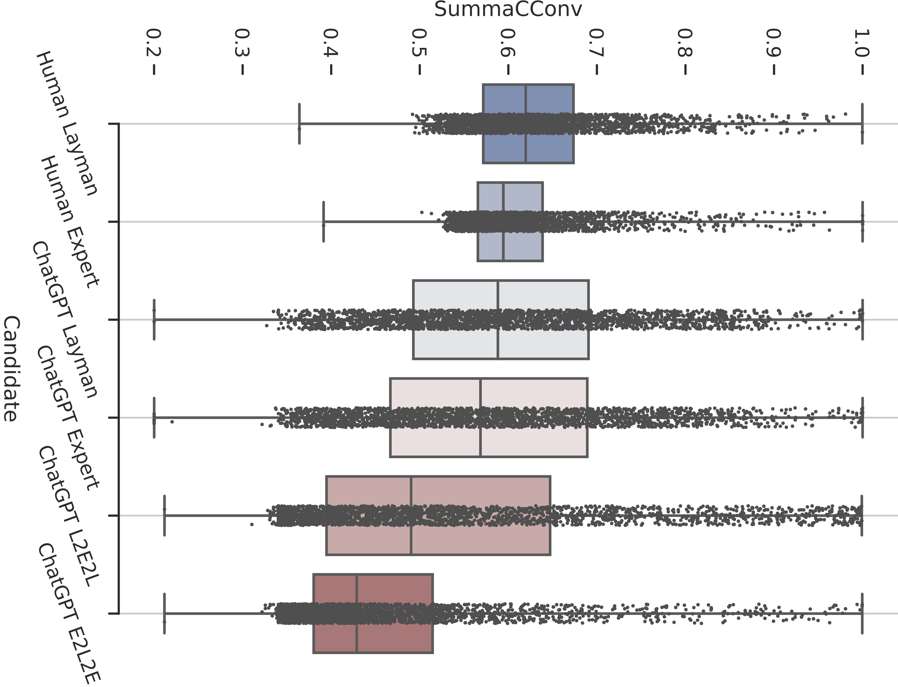

<script src="https://cdn.mathjax.org/mathjax/latest/MathJax.js?config=TeX-AMS-MML_HTMLorMML" type="text/javascript"></script>

####  Abstract: 
Large-scale language models, like ChatGPT, have garnered significant media attention and stunned the public with their remarkable capacity for generating coherent text from short natural language prompts. In this paper, we aim to conduct a systematic inspection of ChatGPT's performance in two controllable generation tasks, with respect to ChatGPT's ability to adapt its output to different target audiences (expert vs. layman) and writing style (formal vs. informal). Additionally, we evaluate the faithfulness of the generated text, and compare the model's performance with human-authored texts. Our findings indicate that the stylistic variations produced by humans are considerably larger than those demonstrated by ChatGPT, and the generated texts diverge from human samples in several characteristics, such as the distribution of word types. Moreover, we observe that ChatGPT sometimes incorporates factual errors or hallucinations when adapting the text to suit a specific style.

<div style="display: flex; justify-content: center;">
    
</div>


#### Citation:

**BibTeX:**

```bibtex
@inproceedings{pu-demberg-2023-chatgpt,
    title = "{C}hat{GPT} vs Human-authored Text: Insights into Controllable Text Summarization and Sentence Style Transfer",
    author = "Liu, Dongqi  and
      Demberg, Vera",
    editor = "Padmakumar, Vishakh  and
      Vallejo, Gisela  and
      Fu, Yao",
    booktitle = "Proceedings of the 61st Annual Meeting of the Association for Computational Linguistics (Volume 4: Student Research Workshop)",
    month = jul,
    year = "2023",
    address = "Toronto, Canada",
    publisher = "Association for Computational Linguistics",
    url = "https://aclanthology.org/2023.acl-srw.1",
    doi = "10.18653/v1/2023.acl-srw.1",
    pages = "1--18",
```
