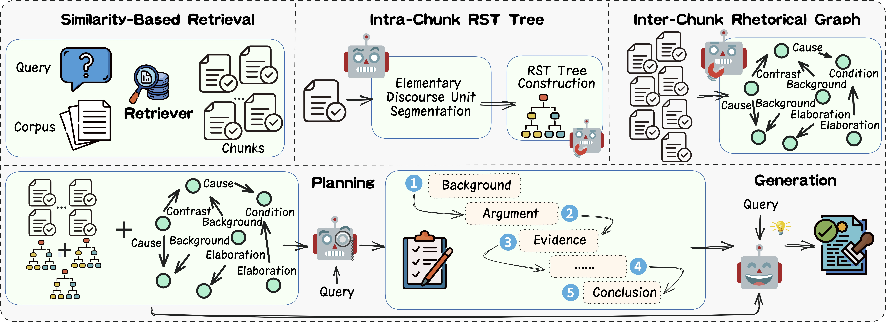

### 📄 Abstract

Retrieval-Augmented Generation (RAG) has emerged as an important means of enhancing the performance of large language models (LLMs) in knowledge-intensive tasks. However, most existing RAG strategies treat retrieved passages in a flat and unstructured way, which prevents the model from capturing structural cues and constrains its ability to synthesize knowledge from dispersed evidence across documents. To overcome these limitations, we propose Disco-RAG, a discourse-aware framework that explicitly injects discourse signals into the generation process. Our method constructs intra-chunk discourse trees to capture local hierarchies and builds inter-chunk rhetorical graphs to model cross-passage coherence. These structures are jointly integrated into a planning blueprint that conditions the generation. Experiments on question answering and long-document summarization benchmarks show the efficacy of our approach. Disco-RAG achieves state-of-the-art results on the benchmarks without fine-tuning. These findings underscore the important role of discourse structure in advancing RAG systems.

### 🔍 Overview

    

### 💻 Code

Our code is publicly available on GitHub: 

可以，删掉 `abstract` 字段后的版本如下：

### 📚 Citation

  <pre id="citation-text-discorag" style="background-color: #f8f9fa; padding: 15px; border-radius: 4px; border-left: 4px solid #007bff; margin: 0; white-space: pre-wrap; overflow-x: auto; font-family: monospace; line-height: 1.5;">
@inproceedings{liu-etal-2026-disco,
  title = {Disco-{RAG}: Discourse-Aware Retrieval-Augmented Generation},
  author = {Liu, Dongqi and Ding, Hang and Feng, Qiming and Xie, Xurong and Xue, Zhucun and Wang, Chengjie and Li, Jian and Zhang, Jiangning and Wang, Yabiao},
  editor = {Liakata, Maria and Moreira, Viviane P. and Zhang, Jiajun and Jurgens, David},
  booktitle = {Proceedings of the 64th Annual Meeting of the {A}ssociation for {C}omputational {L}inguistics (Volume 1: Long Papers)},
  month = jul,
  year = {2026},
  address = {San Diego, California, United States},
  publisher = {Association for Computational Linguistics},
  url = {https://aclanthology.org/2026.acl-long.189/},
  pages = {4106--4136},
  ISBN = {979-8-89176-390-6}
}</pre>

  <button id="copy-button-discorag" onclick="copyBibTeXDiscoRAG()" style="position: absolute; top: 10px; right: 10px; background: #f6f8fa; color: #24292e; border: none; border-radius: 6px; padding: 6px 10px; cursor: pointer; font-size: 12px; display: flex; align-items: center; opacity: 0.6; transition: opacity 0.2s;">
    <svg aria-hidden="true" height="16" viewBox="0 0 16 16" version="1.1" width="16" style="margin-right: 3px;">
      <path fill-rule="evenodd" d="M0 6.75C0 5.784.784 5 1.75 5h1.5a.75.75 0 010 1.5h-1.5a.25.25 0 00-.25.25v7.5c0 .138.112.25.25.25h7.5a.25.25 0 00.25-.25v-1.5a.75.75 0 011.5 0v1.5A1.75 1.75 0 019.25 16h-7.5A1.75 1.75 0 010 14.25v-7.5z"></path>
      <path fill-rule="evenodd" d="M5 1.75C5 .784 5.784 0 6.75 0h7.5C15.216 0 16 .784 16 1.75v7.5A1.75 1.75 0 0114.25 11h-7.5A1.75 1.75 0 015 9.25v-7.5zm1.75-.25a.25.25 0 00-.25.25v7.5c0 .138.112.25.25.25h7.5a.25.25 0 00.25-.25v-7.5a.25.25 0 00-.25-.25h-7.5z"></path>
    </svg>
  </button>

  
  
  

