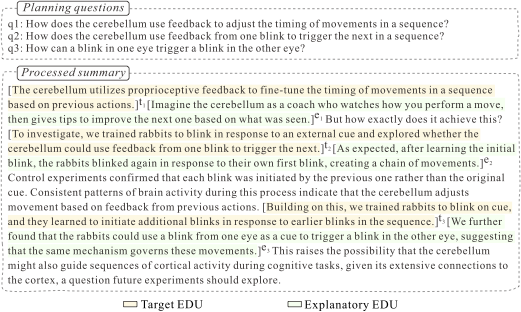

<script src="https://cdn.mathjax.org/mathjax/latest/MathJax.js?config=TeX-AMS-MML_HTMLorMML" type="text/javascript"></script>

### Abstract

Lay summaries for scientific documents typically include explanations to help readers grasp sophisticated concepts or arguments. However, current automatic summarization methods do not explicitly model explanations, which makes it difficult to align the proportion of explanatory content with human-written summaries. In this paper, we present a plan-based approach that leverages discourse frameworks to organize summary generation and guide explanatory sentences by prompting responses to the plan. Specifically, we propose two discourse-driven planning strategies, where the plan is conditioned as part of the input or part of the output prefix, respectively. Empirical experiments on three lay summarization datasets show that our approach outperforms existing state-of-the-art methods in terms of summary quality, and it enhances model robustness, controllability, and mitigates hallucination.

<div style="display: flex; justify-content: center;">
    
</div>

### Code and Data

Our code and data are publicly available on GitHub: [ExpSum GitHub Repository](https://github.com/dongqi-me/ExpSum)

### Citation:

**BibTeX:**

```bibtex
@article{liu2025explanatory,
  title={Explanatory Summarization with Discourse-Driven Planning},
  author={Liu, Dongqi and Yu, Xi and Demberg, Vera and Lapata, Mirella},
  journal={arXiv preprint arXiv:2504.19339},
  year={2025}
}
```
