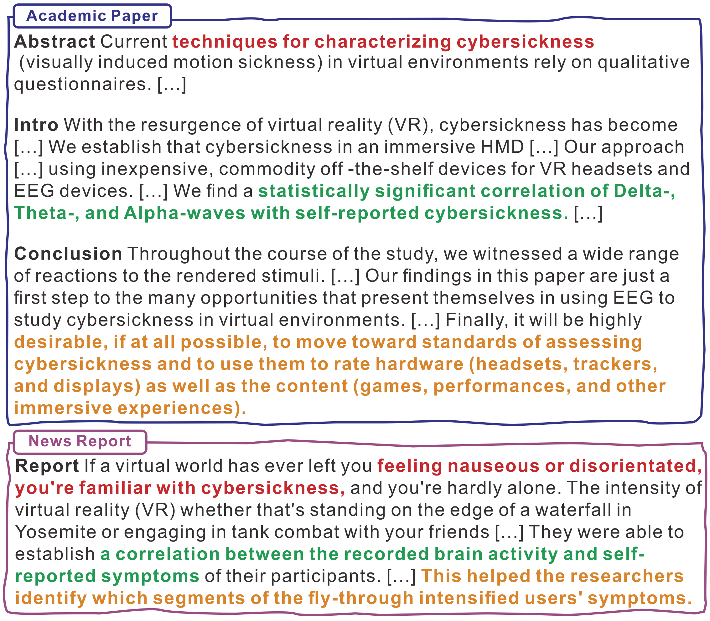

## 📄 Project Overview

The SciNews dataset is designed to facilitate the development and evaluation of models that generate scientific news reports from scholarly articles. This dataset aims to bridge the gap between complex scientific research and the general public by simplifying and summarizing academic content into accessible narratives. It supports tasks like text summarization, simplification, and the automated generation of scientific news, providing a valuable resource for enhancing public engagement with science and technology.

    

## 📊 Dataset Details

### 📋 Dataset Description

- **Curated by:** Dongqi Liu, Yifan Wang, Jia Loy, Vera Demberg from the (1). Department of Computer Science and (2). Department of Language Science and Technology at Saarland Informatics Campus, Saarland University, Germany.
- **Funded by:** This project has received funding from the European Research Council (ERC) under the European Union's Horizon 2020 Research and Innovation Programme (Grant Agreement No. 948878).
- **Language(s) (NLP):** English

### 🔗 Dataset Sources

- **Repository:** Dataset is available at: 
- **Paper:** The details about the dataset can be found in the paper "[SciNews: From Scholarly Complexities to Liublic Narratives – A Dataset for Scientific News Report Generation](https://aclanthology.org/2024.lrec-main.1258/)" by Dongqi Liu, Yifan Wang, Jia Loy, Vera Demberg.

## 🔍 Dataset Creation

### 📥 Data Collection and Processing

Data was collected from the Science X platform, an open-access hub for science, technology, and medical research news. Data extraction was performed using web scraping tools like Selenium and BeautifulSoup.

### 🏷️ Annotations

The dataset does not include additional annotations as it is a compilation of existing scientific papers and their corresponding news reports. The quality control included automated and human assessments to ensure the relevance and quality of the news narratives in relation to the original scientific papers.

### 💡 Recommendations

Users of the SciNews dataset should be aware of its limitations and biases, particularly when developing models for scientific news generation. Efforts should be made to address potential biases and ensure that generated narratives accurately and fairly represent the original scientific content.

## 📚 Citation

  <pre id="citation-text-scinews" style="background-color: #f8f9fa; padding: 15px; border-radius: 4px; border-left: 4px solid #007bff; margin: 0; white-space: pre-wrap; overflow-x: auto; font-family: monospace; line-height: 1.5;">
@inproceedings{pu-etal-2024-scinews-scholarly,
    title = "{S}ci{N}ews: From Scholarly Complexities to Public Narratives {--} a Dataset for Scientific News Report Generation",
    author = "Liu, Dongqi  and
      Wang, Yifan  and
      Loy, Jia E.  and
      Demberg, Vera",
    editor = "Calzolari, Nicoletta  and
      Kan, Min-Yen  and
      Hoste, Veronique  and
      Lenci, Alessandro  and
      Sakti, Sakriani  and
      Xue, Nianwen",
    booktitle = "Proceedings of the 2024 Joint International Conference on Computational Linguistics, Language Resources and Evaluation (LREC-COLING 2024)",
    month = may,
    year = "2024",
    address = "Torino, Italy",
    publisher = "ELRA and ICCL",
    url = "https://aclanthology.org/2024.lrec-main.1258",
    pages = "14429--14444",
}</pre>
  <button onclick="copyBibTeXSciNews()" style="position: absolute; top: 10px; right: 10px; background: #007bff; color: white; border: none; border-radius: 4px; padding: 5px 10px; cursor: pointer; font-size: 14px;">
    Copy
  </button>

    
    

## 📬 Contact

For further inquiries or questions regarding the SciNews dataset, please contact: 

